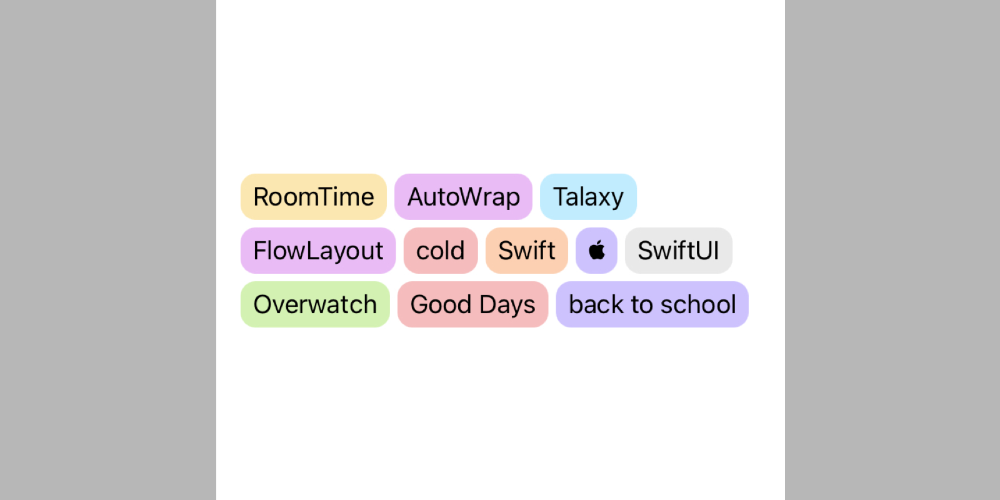

# RoomTime

RoomTime is a bundle of tools developed in my app `RoomTime Lite`. (😊 RoomTime Lite is still in development)

# Features

- [TextArea](#textarea)
- [AutoWrap](#autowrap)
- *more in developing ...*

# Requirements

- iOS 13 or newer
- tvOS 13 or newer
- watchOS 6 or newer
- *macOS is not supported currently*

# Installation

1. In Xcode project, navigate to **File -> Swift Packages -> Add Package Dependency...**.
2. Paste `https://github.com/RainbowTalaxy/RoomTime` and click **Next**.

# Usage

## TextArea

`TextArea` uses like SwiftUI's `TextEditor`, but not supports internal modifiers such as `.font(_)`.

```swift
struct TextAreaDemo: View {
    @State private var text = ""
    
    var body: some View {
        // 'extraHeight' is default by 0
        TextArea(text: $text, extraHeight: 100)
    }
}
```

## AutoWrap

`AutoWrap` can let views wrap automaticly:



```swift
struct AutoWrapDemo: View {
    let data = [
        "RoomTime", "AutoWrap", "Talaxy", "FlowLayout", "cold",
        "Swift", "", "SwiftUI", "Overwatch", "Good Days", "back to school"
    ]
    
    var body: some View {
        // 'vSpacing' and 'hSpacing' are both default by 0
        AutoWrap(data, id: \.self, vSpacing: 5, hSpacing: 5) { text in
            Tag(text, bgcolor: RTColor.Tag.random())
        }
        .padding()
    }
}
```
