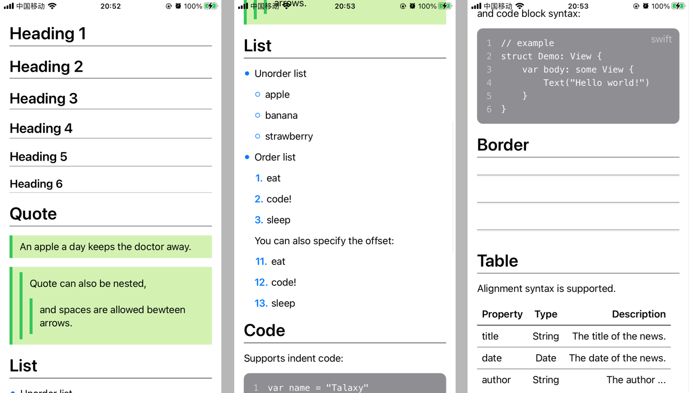
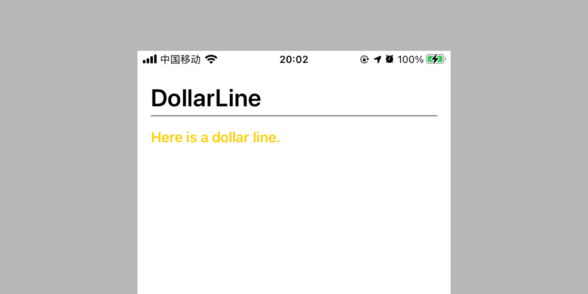

# RoomTime

RoomTime is a bundle of tools developed in my app `RoomTime Lite`. (😊 RoomTime Lite is still in development)

# Features

- [TextArea](#textarea)
- [AutoWrap](#autowrap)
- [Markdown](#markdown)
- *more in developing ...*

# Requirements

- iOS 13 or newer
- tvOS 13 or newer
- watchOS 6 or newer
- *macOS is not supported currently*

# Installation

1. In Xcode project, navigate to **File -> Swift Packages -> Add Package Dependency...** .
2. Paste `https://github.com/RainbowTalaxy/RoomTime` and click **Next**.

# Usage

## TextArea

`TextArea` uses like SwiftUI's `TextEditor`, but not supports internal modifiers such as `.font(_)`.

```swift
import RoomTime

struct TextAreaDemo: View {
    @State private var text = ""
    
    var body: some View {
        // 'extraHeight' is default by 0
        TextArea(text: $text, extraHeight: 100)
    }
}
```

## AutoWrap

`AutoWrap` can let views wrap automaticly:


```swift
import RoomTime

struct AutoWrapDemo: View {
    let data = [
        "RoomTime", "AutoWrap", "Talaxy", "FlowLayout", "cold",
        "Swift", "", "SwiftUI", "Overwatch", "Good Days", "back to school"
    ]
    
    var body: some View {
        // 'vSpacing' and 'hSpacing' are both default by 0
        AutoWrap(data, id: \.self, vSpacing: 5, hSpacing: 5) { text in
            Tag(text, bgcolor: RTColor.Tag.random())
        }
        .padding()
    }
}
```

## Markdown

`Markdown` is a separate module, so you just need to import `Markdown`.

Here is a brief usage:

```swift
import Markdown

struct MarkdownDemo: View {
    let text: String
    
    var body: some View {
        ScrollView {
            Markdown(text: text) { element in
                ElementView(element: element)
            }
            .padding()
        }
    }
}
```

### Syntax support

* header 1-6
* quote
* order or unorder list
* indent or block code
* border
* table
* *more in development ...*

Here gives a text which shows what `Markdown` supports:

    # Heading 1
    ## Heading 2
    ### Heading 3
    #### Heading 4
    ##### Heading 5
    ###### Heading 6

    # Quote

    > An apple a day keeps the doctor away.

    >> Quote can also be nested,
    > > > and spaces are allowed bewteen arrows.

    # List

    * Unorder list

      - apple
      + banana
      * strawberry

    * Order list

      1. eat
      2. code!
      3. sleep

      You can also specify the offset:
      
      11. eat
      2. code!
      3. sleep

    # Code

    Supports indent code:

        var name = "Talaxy"

    and code block syntax:

    ```swift
    // example
    struct Demo: View {
        var body: some View {
            Text("Hello world!")
        }
    }
    ```

    # Border

    ---
    * * *
    __ ___ ____

    # Table

    Alignment syntax is supported.

    | Property | Type   | Description |
    |:-------- |:------:| -----------:|
    | title    | String | The title of the news. |
    | date     | Date   | The date of the news. |
    | author   | String | The author ... |


### Mechanism

`Markdown` uses `Renderer` to convert text into markdown elements.

`Renderer` has two rendering stages: "Spliting" and "Mapping" :



In "Spliting" stage, `Renderer` splits text into `Raw`s by `SplitRule` instances orderly.

Here is the definetion of the `Raw`:
```swift
public struct Raw: Hashable {
    public let lock: Bool
    public let text: String
    public let type: String?
}
```

* `lock` tells the `Renderer` whether wants to be splited by further split rules.
* `text` contains the text itself.
* `type` is for "Mapping" stage.

In "Mapping" stage, `Renderer` converts `Raw`s into `Element` objects.

### Extend syntax supports

With `Markdown` rendering mechanism, you can customize your rendering rule.

For Example, if you want to highlight lines which starts with `$` sign, you can implement by steps below:

First, create render rule:

```swift
import Markdown

class DollarLineElement: Element {
    let text: String
    
    init(text: String) {
        self.text = text
    }
}

fileprivate let dollerLineType = "doller"
fileprivate let dollerLineRegex = #"^\$ +.*$"#
fileprivate let dollerSignRegex = #"^\$ +(?=.*$)"#

class DollarSplitRule: SplitRule {
    override func split(from text: String) -> [Raw] {
        // You can use the inherited method `split(by:text:type:)`
        // to easily split text by Regex.
        return split(by: dollerLineRegex, text: text, type: dollerLineType)
    }
}

class DollarMapRule: MapRule {
    override func map(from raw: Raw, resolver: Resolver?) -> Element? {
        if raw.type == dollerLineType {
            // `replace(by:with:)` is a method nested in Markdown.
            // It helps you replace text by Regex easily.
            let line = raw.text.replace(by: dollerSignRegex, with: "")
            return DollarLineElement(text: line)
        } else {
            return nil
        }
    }
}
```

Second, define `DollarLine` view:

```swift
import SwiftUI

struct DollarLine: View {
    let element: DollarLineElement
    
    var body: some View {
        Text(element.text)
            .bold()
            .foregroundColor(Color.yellow)
    }
}
```

Third, confgure the `Renderer`:

```swift
let splitRules: [SplitRule] = defaultSplitRules + [
    DollarSplitRule(priority: 4.5)
]

let mapRules: [MapRule] = defaultMapRules + [
    DollarMapRule(priority: 4.5)
]

let resolver = Resolver(splitRules: splitRules, mapRules: mapRules)
```

Finally, use `Markdown` and extend element view:

```swift
struct MarkdownDemo: View {
    let text: String = """
        # DollarLine
        $ Here is a dollar line.
        """
    
    var body: some View {
        ScrollView {
            Markdown(text: text, resolver: resolver) { element in
                // default view mapping
                ElementView(element: element)
                
                switch element {
                case let dollarLine as DollarLineElement:
                    DollarLine(element: dollarLine)
                default:
                    EmptyView()
                }
            }
            .padding()
        }
    }
}
```

Here is the output:


